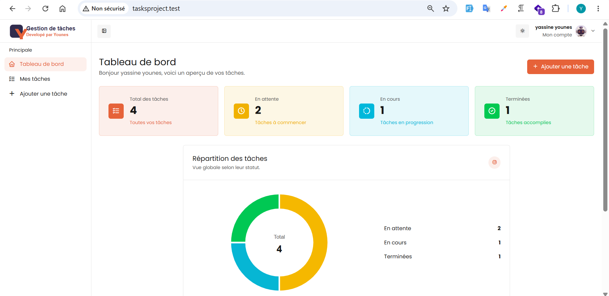
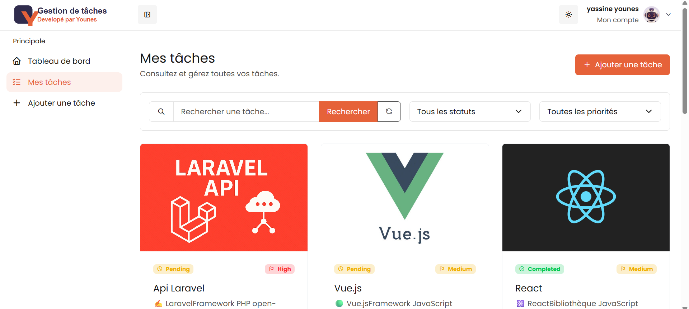
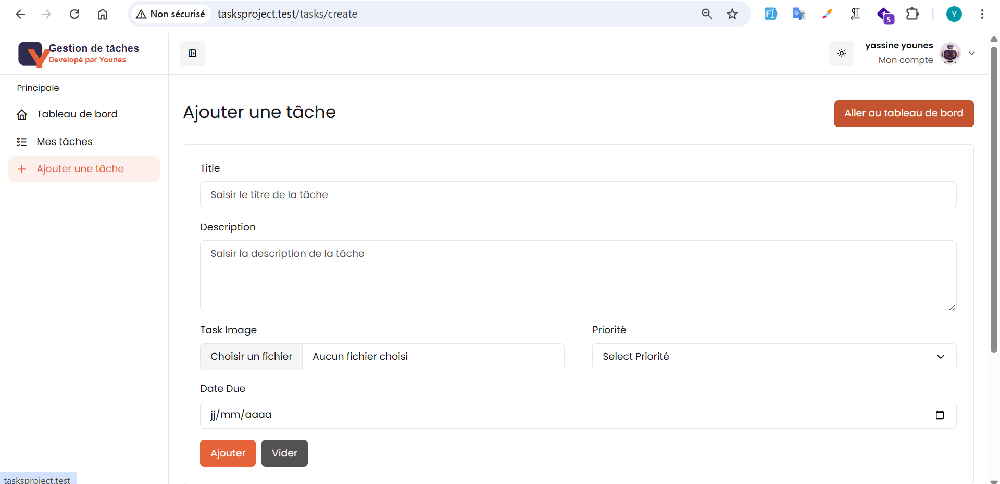
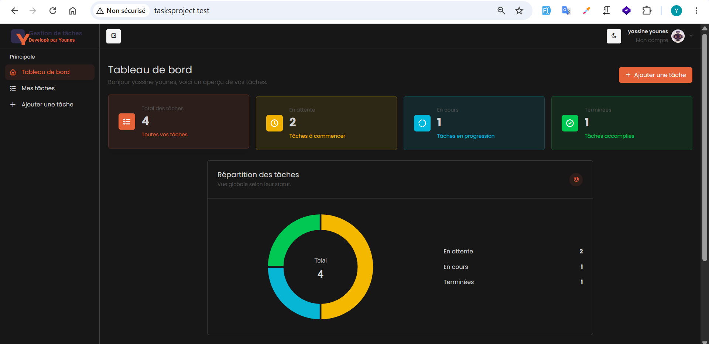

# Gestion de tâches

Application web de gestion de tâches personnelles développée avec Laravel.

Chaque utilisateur peut créer et organiser ses propres tâches, suivre leur progression, définir leur priorité et consulter un tableau de bord récapitulatif.

## Fonctionnalités

- Inscription et authentification des utilisateurs
- Déconnexion sécurisée
- Création, consultation, modification et suppression des tâches
- Isolation des tâches par utilisateur
- Ajout d’une image facultative
- Suppression automatique de l’ancienne image lors du remplacement
- Gestion des statuts :
  - En attente
  - En cours
  - Terminée
- Gestion des priorités :
  - Faible
  - Moyenne
  - Élevée
- Définition d’une date d’échéance
- Recherche des tâches par titre
- Filtrage par statut et priorité
- Combinaison de plusieurs critères de filtrage
- Pagination avec conservation des filtres
- Tableau de bord avec statistiques
- Graphique de répartition des tâches
- Mode clair et mode sombre
- Interface responsive
- Pages d’erreur personnalisées 403 et 404
- Protection contre l’accès aux tâches d’un autre utilisateur

## Technologies utilisées

- PHP
- Laravel 10
- MySQL
- Laravel Breeze
- Blade
- Bootstrap
- SCSS
- JavaScript
- Vite
- ApexCharts
- Tabler Icons
- Git et GitHub

## Installation

### 1. Cloner le projet

```bash
git clone https://github.com/YASSINE-Younes/TasksPorject.git
```

Accéder au dossier :

```bash
cd TasksPorject
```

### 2. Installer les dépendances PHP

```bash
composer install
```

### 3. Installer les dépendances JavaScript

```bash
npm install
```

### 4. Créer le fichier d’environnement

Sous Windows :

```bash
copy .env.example .env
```

Sous Linux ou macOS :

```bash
cp .env.example .env
```

### 5. Générer la clé de l’application

```bash
php artisan key:generate
```

### 6. Configurer la base de données

Modifier les informations suivantes dans `.env` :

```env
DB_CONNECTION=mysql
DB_HOST=127.0.0.1
DB_PORT=3306
DB_DATABASE=tasks_project
DB_USERNAME=root
DB_PASSWORD=
```

Créer ensuite la base de données :

```text
tasks_project
```

### 7. Exécuter les migrations

```bash
php artisan migrate
```

### 8. Créer le lien symbolique du stockage

```bash
php artisan storage:link
```

Cette commande permet d’afficher les images enregistrées dans :

```text
storage/app/public/tasks
```

### 9. Démarrer Vite

```bash
npm run dev
```

### 10. Démarrer Laravel

```bash
php artisan serve
```

L’application sera accessible à l’adresse :

```text
http://127.0.0.1:8000
```

## Compilation pour la production

Pour générer les fichiers CSS et JavaScript destinés à la production :

```bash
npm run build
```

Dans l’environnement de production :

```env
APP_ENV=production
APP_DEBUG=false
```

## Sécurité

L’application vérifie que chaque tâche appartient à l’utilisateur connecté avant d’autoriser sa consultation, sa modification ou sa suppression.

Une tentative d’accès à la tâche d’un autre utilisateur retourne une réponse :

```text
403 Accès interdit
```

Les liens inexistants retournent une page personnalisée avec le statut HTTP :

```text
404 Page introuvable
```

## Captures d’écran

### Tableau de bord


### Liste des tâches



### Ajout d’une tâche



### Mode sombre


## Améliorations futures

- Réinitialisation du mot de passe
- Vérification de l’adresse e-mail
- Notifications avant la date d’échéance
- Utilisation des Policies Laravel
- Tests automatisés
- API REST
- Application frontend avec Vue.js

## Auteur

Développé par **Yassine Younes**.

GitHub : [YASSINE-Younes](https://github.com/YASSINE-Younes)

## Licence

Ce projet a été réalisé à des fins d’apprentissage et de présentation professionnelle.